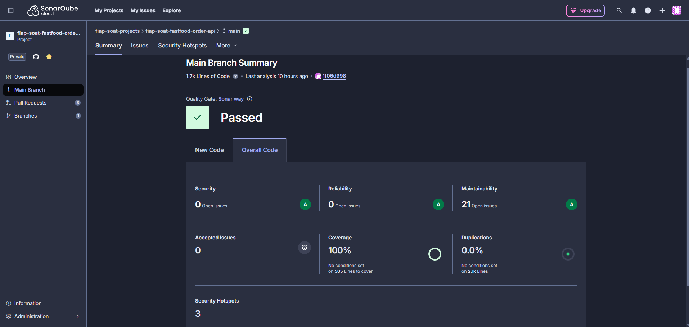

# 🍔 FastFood Order API

Este projeto foi desenvolvido para o curso de [pós-graduação em Arquitetura de Software (Soat Póstech) da FIAP](https://postech.fiap.com.br/curso/software-architecture/).

A API presente neste repositório disponibiliza rotas para gerenciamento de cardápio e pedidos , com integração direta com [MongoDB](https://www.mongodb.com/).

## 🏃 Integrantes do grupo

- Jeferson dos Santos Gomes - **RM 362669**
- Jamison dos Santos Gomes - **RM 362671**
- Alison da Silva Cruz - **RM 362628**

## 📜 Linguagem Ubíqua 

Para mais detalhes sobre a linguagem do domínio, consulte [`docs/ubiquitous-language.md`](docs/ubiquitous-language.md).

## 👨‍💻 Tecnologias Utilizadas

- **.NET 10** (C# 14)
- **ASP.NET Core Web API**
- **MongoDB** (banco de dados)
- **Mongo Express** (cliente web para MongoDB)
- **Docker** e **Docker Compose**
- **Kubernetes** (gerenciamento de containers)
- **Scalar** (documentação automática)

## 🏁 Como Inicializar

### Pré-requisitos

- 🐈‍⬛ Clonar este [Repositório](https://github.com/fiap-soat-projects/fiap-soat-fastfood-order-api)
- 🐳 Instalar o [Docker](https://www.docker.com/get-started/)
- ☸️ Habilitar o Kubernetes no [Docker](https://docs.docker.com/desktop/features/kubernetes/)

Podemos executar essa aplicação de 2 maneiras diferentes:

### 1. **Docker**:

No diretório raiz na pasta do projeto, utilize uma ferramenta de linha de comando de sua preferência e execute o comando `docker-compose up --build`.

A API e seus recursos estão disponíveis em:
- **API**: [http://localhost:8080/scalar](http://localhost:8080/scalar)
- **Mongo Express**: [http://localhost:8081](http://localhost:8081)

### 2. **Kubernetes**:

No nosso repositório temos o diretório `/k8s` onde disponibilizamos todos os manifestos associados ao deploy e configuração da nossa API e banco de dados.

Para utilizar esses recursos, precisaremos de alguns passos adicionais para preparação do ambiente:

2.1 **Criar `namespaces` personalizados no Kubernetes**:

   Com o cluster **K8s** habilitado, precisaremos executar os seguintes comandos:

   - `kubectl create namespace fiap`

2.2 Aplicar manifestos

Acesse o diretório `/k8s` e execute o comando `kubectl apply -f .`, isso fará com que todos os recursos descritos nos manifestos sejam aplicados no **K8s**. Com essa ação, teremos as APIs disponíveis em `http://localhost:30080`.

---

### Sonar Coverage:

## Dicas e Truques:

- Utilize o Kubernetes com **[K9S](https://k9scli.io/)**: O **K9S** é uma interface para terminal que permite uma navegação simplificada entre os recursos do Kubernetes. É uma excelente ferramenta de produtividade, pois elimina as diversas chamadas que normalmente são realizadas através do `kubectl`.

- Utilize o **[K6](https://k6.io/)** para testar o scaling: O **K6** é uma ferramenta para execução de testes de carga. Neste projeto, temos o diretório `/k6` onde disponibilizamos scripts que irão estressar alguns endpoints do nosso serviço e, caso esteja executando no **K8s**, será possível verificar o scaling up e scaling down.

- Visualize as informações no **Prometheus**: No **K8s** temos uma stack do Prometheus em execução e é possível fazer um port-forward para que a UI seja acessível externamente. Para isso, execute o comando `kubectl port-forward -n monitoring svc/prometheus-kube-prometheus-prometheus 9090` e acesse em `http://localhost:9090`.

## Endpoints Disponíveis

### 🍔 Order (Pedido)
- `GET /order?page=1&size=10&status=Received` — Listar todos pedidos em página
- `GET /order/active?page=1&size=10` — Listar pedidos ativos em página de forma ordenada e excluindo pedidos inativos.
- `GET /order/{id}` — Detalhar pedido
- `POST /order` — Criar pedido
- `PATCH /order/{id}/status` — Atualizar status do pedido
- `PATCH /order/{id}/payment` — Atualizar pagamento do pedido
- `DELETE /order/{id}` — Remover pedido

### 📲 Menu (Cardápio)
- `GET /menu/{id}` — Detalhar item do cardápio
- `GET /menu?name=string&category=0&skip=0&limit=10` — Listar itens do cardápio
- `POST /menu` — Cadastrar item no cardápio
- `PUT /menu/{id}` — Atualizar item do cardápio
- `DELETE /menu/{id}` — Remover item do cardápio

### 🏥 HealthCheck (Saúde)
- `GET /healthz` — Saúde da API
- `GET /health` — Saúde da API e suas dependências

Se preferir, as requisições descritas acima podem ser acessadas via [Postman](https://www.postman.com/) por meio da seguinte documentação:

- [fiap-soat-fastfood](https://documenter.getpostman.com/view/7741479/2sB3BAMYQs)

## 👤 Convenções

- Todos os endpoints aceitam e retornam JSON.
- Utilize o Scalar para explorar e testar os endpoints.

## 🏦 Banco de Dados

Neste projeto utilizamos o [MongoDB Atlas](https://www.mongodb.com/products/platform) que é um serviço de banco de dados como serviço (DBaaS) totalmente gerenciado para o MongoDB, disponível na nuvem. Ele permite criar, escalar e gerenciar clusters MongoDB de forma simples, segura e automatizada, sem a necessidade de gerenciar infraestrutura física. O Atlas oferece recursos como backups automáticos, monitoramento, alta disponibilidade, escalabilidade sob demanda e integração com provedores de nuvem como AWS, Azure e Google Cloud.

#### 📦 Estrutura das Collections MongoDB

##### **orders**

| Campo         | Tipo                |
|---------------|---------------------|
| _id           | ObjectId            |
| CustomerId    | string              |
| CustomerName  | string              |
| Items         | array de objetos    |
| Status        | int                 |
| Payment       | objeto              |
| TotalPrice    | decimal             |
| CreatedAt     | datetime            |
| UpdatedAt     | datetime/null       |

**OrderItem** (subdocumento de `orders.Items`)

| Campo   | Tipo     |
|---------|----------|
| Id      | string   |
| Name    | string   |
| Price   | decimal  |
| Amount  | int      |
| Category| int      |

**Payment** (subdocumento de `orders.Payment`)

| Campo  | Tipo   |
|--------|--------|
| Id     | string |
| Method | int    |
| Status | int    |

##### **menu**

| Campo       | Tipo        |
|-------------|-------------|
| _id         | ObjectId    |
| Name        | string      |
| Description | string      |
| Price       | decimal     |
| IsActive    | bool        |
| Category    | int         |
| CreatedAt   | datetime    |
| UpdatedAt   | datetime/null |

---

## 🧩 Arquitetura: Princípios SOLID & Clean Architecture

Este projeto foi estruturado seguindo os princípios do **SOLID** e os conceitos do **Clean Architecture**, visando garantir um sistema desacoplado, coeso, testável e de fácil manutenção.

### Princípios SOLID

- **S**ingle Responsibility Principle (Responsabilidade Única):  
  Cada classe ou módulo possui uma única responsabilidade bem definida, facilitando a manutenção e evolução do código.

- **O**pen/Closed Principle (Aberto/Fechado):  
  Os componentes do sistema são abertos para extensão, mas fechados para modificação, permitindo adicionar novas funcionalidades sem alterar o código existente.

- **L**iskov Substitution Principle (Substituição de Liskov):  
  As subclasses podem ser substituídas por suas classes base sem afetar o funcionamento do sistema.

- **I**nterface Segregation Principle (Segregação de Interfaces):  
  Interfaces específicas são preferidas a interfaces genéricas, evitando que classes dependam de métodos que não utilizam.

- **D**ependency Inversion Principle (Inversão de Dependência):  
  O domínio depende de abstrações (interfaces), e não de implementações concretas, promovendo baixo acoplamento entre as camadas.

### Clean Architecture

- **Separação de Camadas:**  
  O projeto é dividido em camadas bem definidas, separada por projetos de Business, Adapters, Drivers(Api, Infrastructure)

- **Isolamento da Lógica de Negócio:**  
  A lógica de negócio reside na camada de domínio (Business), isolada de detalhes técnicos e de infraestrutura.

- **Gateways e Interfaces:**  
  Dependências externas (bancos de dados, APIs, etc.) são representadas por interfaces na camada de domínio. As implementações concretas ficam na infraestrutura.

- **Injeção de Dependências:**  
  A ligação entre interfaces e implementações é feita via injeção de dependências, facilitando testes e substituição de componentes.

**Benefícios:**
- Facilita testes unitários e integração.
- Permite evolução e manutenção do sistema sem impactar a lógica de negócio.
- Garante flexibilidade para trocar tecnologias e integrações externas.
- Segue as melhores práticas de arquitetura de software moderna.

> **Resumo:**  
> O projeto foi desenhado para que cada camada tenha responsabilidades claras e isoladas, promovendo um código limpo, sustentável e preparado para mudanças futuras.
